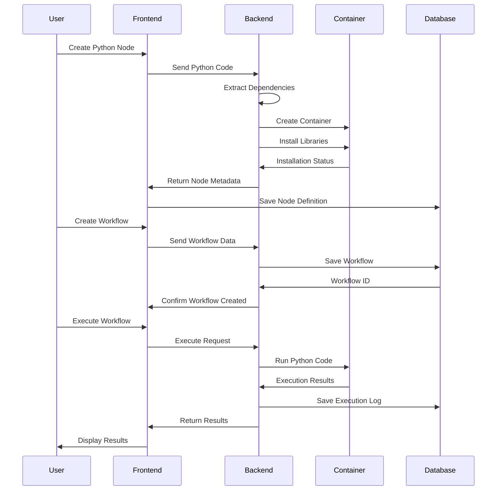
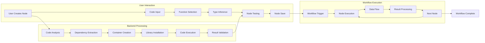
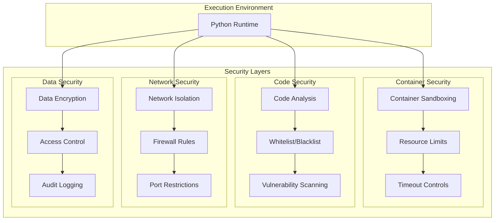
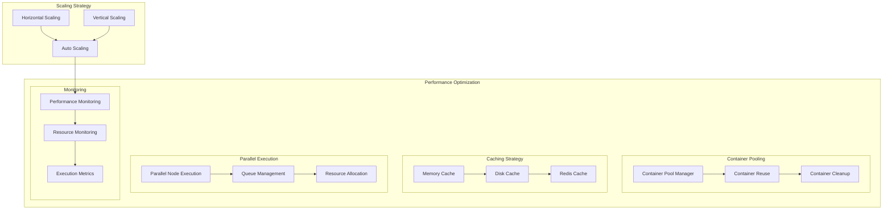

# Qflow Architecture Diagram

```mermaid
graph TB
    subgraph "Frontend Layer (n8n-based)"
        UI[Qflow Editor UI]
        subgraph "Python Node Components"
            PN[Python Node Editor]
            PE[Python Code Editor]
            TS[Type Selector]
            FS[Function Selector]
            TN[Node Tester]
        end
        
        subgraph "Workflow Components"
            WF[Workflow Canvas]
            NC[Node Connections]
            EM[Execution Monitor]
            EL[Execution Logs]
        end
        
        subgraph "State Management"
            PS[Python Nodes Store]
            WS[Workflows Store]
            ES[Execution Store]
        end
    end
    
    subgraph "Backend Layer (Python-First)"
        API[FastAPI Backend]
        
        subgraph "Core Services"
            PES[Python Execution Service]
            CMS[Container Management Service]
            DMS[Dependency Management Service]
            WFS[Workflow Service]
            TS[Type System Service]
        end
        
        subgraph "Execution Engine"
            PE[Python Execution Engine]
            TC[Type Checker]
            DC[Data Converter]
            EH[Error Handler]
        end
        
        subgraph "Container Management"
            DC[Docker Client]
            CP[Container Pool]
            CI[Container Isolation]
        end
    end
    
    subgraph "Data Layer"
        DB[(PostgreSQL)]
        REDIS[(Redis Cache)]
        FS[File Storage]
    end
    
    subgraph "Python Environments"
        subgraph "Docker Containers"
            PY38[Python 3.8]
            PY39[Python 3.9]
            PY310[Python 3.10]
            PY311[Python 3.11]
            PY312[Python 3.12]
        end
        
        subgraph "Library Management"
            PIP[Pip Installer]
            REQ[Requirements Manager]
            DEP[Dependency Resolver]
        end
    end
    
    subgraph "External Integrations"
        AI[AI Services]
        WEB[Web Services]
        FILE[File Systems]
        DB_EXT[External Databases]
    end
    
    %% Frontend connections
    UI --> PN
    UI --> WF
    UI --> EM
    
    PN --> PE
    PN --> TS
    PN --> FS
    PN --> TN
    
    WF --> NC
    WF --> EL
    
    PS --> API
    WS --> API
    ES --> API
    
    %% Backend connections
    API --> PES
    API --> CMS
    API --> DMS
    API --> WFS
    API --> TS
    
    PES --> PE
    PE --> TC
    PE --> DC
    PE --> EH
    
    CMS --> DC
    DC --> CP
    CP --> CI
    
    DMS --> PIP
    DMS --> REQ
    DMS --> DEP
    
    %% Data connections
    API --> DB
    API --> REDIS
    API --> FS
    
    %% Container connections
    PE --> PY38
    PE --> PY39
    PE --> PY310
    PE --> PY311
    PE --> PY312
    
    PIP --> PY38
    PIP --> PY39
    PIP --> PY310
    PIP --> PY311
    PIP --> PY312
    
    %% External connections
    PE --> AI
    PE --> WEB
    PE --> FILE
    PE --> DB_EXT
    
    %% Styling
    classDef frontend fill:#e3f2fd
    classDef backend fill:#f3e5f5
    classDef data fill:#e8f5e8
    classDef containers fill:#fff3e0
    classDef external fill:#f1f8e9
    
    class UI,PN,PE,TS,FS,TN,WF,NC,EM,EL,PS,WS,ES frontend
    class API,PES,CMS,DMS,WFS,TS,PE,TC,DC,EH,DC,CP,CI backend
    class DB,REDIS,FS data
    class PY38,PY39,PY310,PY311,PY312,PIP,REQ,DEP containers
    class AI,WEB,FILE,DB_EXT external
```

## Data Flow Architecture

## Component Interaction Flow

## Security Architecture

## Performance Architecture

## Key Architectural Decisions

### 1. **Container Strategy** ✅ **DECIDED**
- **One container per workflow** for performance (shared environment)
- **Isolated environments** per workflow execution
- **Base image pooling** for common Python versions
- **Node-specific layers** for unique dependencies

### 2. **Data Flow Strategy** ✅ **DECIDED: Hybrid Approach**
- **JSON serialization** for simple data types (strings, numbers, booleans, basic lists/dicts)
- **Pickle serialization** for complex Python objects (custom classes, numpy arrays, pandas DataFrames)
- **File storage** for large datasets (images, videos, large files)
- **Type-aware conversion** between Python and n8n formats

### 3. **Type-Based Node Linking Strategy** ✅ **IMPLEMENTED**
- **Strict type compatibility** - only nodes with compatible types can be connected
- **Type hierarchy support** - inheritance relationships (e.g., `int` → `number`)
- **Visual feedback** - clear indication of valid/invalid connections
- **Error prevention** - block invalid connections before execution
- **Type suggestions** - automatic suggestions for compatible types

### 4. **Security Strategy** ✅ **APPROVED**
- **Docker container isolation** for code execution
- **Resource limits** (CPU: 50%, Memory: 512MB, Time: 30s per node)
- **Code analysis** for dangerous operations
- **Import whitelist/blacklist** for library control
- **Real-time monitoring** of resource usage

### 5. **Performance Strategy** ✅ **APPROVED**
- **Container pooling** for frequently used environments
- **Code compilation** and caching (JIT compilation)
- **Parallel execution** of independent nodes
- **Resource monitoring** and limits
- **Caching** of intermediate results

### 6. **Error Handling Strategy** ✅ **APPROVED**
- **Exception capture** and conversion to n8n format
- **Detailed stack traces** in the UI
- **Error recovery** and retry mechanisms
- **Graceful degradation** for failed nodes
- **Error categorization** and analytics

## Technology Stack

### Frontend
- **Vue.js 3** with Composition API
- **Vue Flow** for workflow canvas
- **CodeMirror 6** for Python code editing
- **Element Plus** for UI components
- **Pinia** for state management

### Backend
- **FastAPI** for REST API
- **Celery** for async task processing
- **Docker** for container management
- **PostgreSQL** for data persistence
- **Redis** for caching and queues

### Execution
- **Python Runtime** in isolated containers
- **Pip** for dependency management
- **Type checking** with runtime validation
- **Error handling** with comprehensive logging

This architecture provides a robust foundation for Qflow while maintaining the visual workflow design capabilities of n8n and adding powerful Python execution capabilities. 