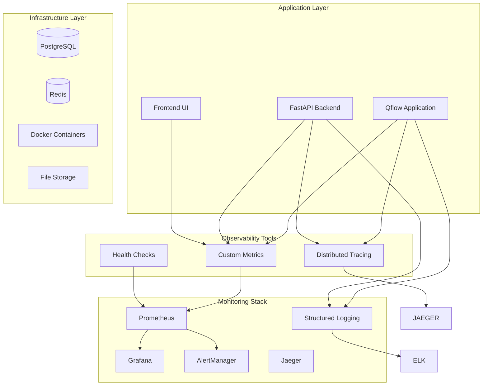

# Qflow Monitoring and Observability

## Overview

This document defines the comprehensive monitoring and observability strategy for Qflow, ensuring reliable operation, performance optimization, and proactive issue detection for the Python-first workflow orchestration platform.

## Monitoring Architecture

### Monitoring Stack



## Key Metrics

### 1. Application Metrics

#### Workflow Execution Metrics
```python
# Workflow execution metrics
WORKFLOW_EXECUTION_DURATION = Histogram(
    'qflow_workflow_execution_duration_seconds',
    'Duration of workflow executions',
    ['workflow_id', 'status', 'python_version']
)

WORKFLOW_EXECUTION_COUNT = Counter(
    'qflow_workflow_executions_total',
    'Total number of workflow executions',
    ['status', 'python_version']
)

WORKFLOW_SUCCESS_RATE = Gauge(
    'qflow_workflow_success_rate',
    'Success rate of workflow executions',
    ['workflow_id']
)
```

#### Node Execution Metrics
```python
# Node execution metrics
NODE_EXECUTION_DURATION = Histogram(
    'qflow_node_execution_duration_seconds',
    'Duration of node executions',
    ['node_type', 'node_id', 'status']
)

NODE_EXECUTION_COUNT = Counter(
    'qflow_node_executions_total',
    'Total number of node executions',
    ['node_type', 'status']
)

NODE_ERROR_RATE = Gauge(
    'qflow_node_error_rate',
    'Error rate of node executions',
    ['node_type']
)
```

#### Python Node Metrics
```python
# Python-specific metrics
PYTHON_CODE_EXECUTION_DURATION = Histogram(
    'qflow_python_code_execution_duration_seconds',
    'Duration of Python code execution',
    ['python_version', 'node_id']
)

PYTHON_DEPENDENCY_INSTALLATION_DURATION = Histogram(
    'qflow_python_dependency_installation_duration_seconds',
    'Duration of dependency installation',
    ['python_version', 'package_count']
)

PYTHON_CONTAINER_CREATION_DURATION = Histogram(
    'qflow_python_container_creation_duration_seconds',
    'Duration of container creation',
    ['python_version']
)
```

### 2. Container Metrics

#### Docker Container Metrics
```python
# Container metrics
CONTAINER_CPU_USAGE = Gauge(
    'qflow_container_cpu_usage_percent',
    'CPU usage of containers',
    ['container_id', 'python_version']
)

CONTAINER_MEMORY_USAGE = Gauge(
    'qflow_container_memory_usage_bytes',
    'Memory usage of containers',
    ['container_id', 'python_version']
)

CONTAINER_DISK_USAGE = Gauge(
    'qflow_container_disk_usage_bytes',
    'Disk usage of containers',
    ['container_id', 'python_version']
)

CONTAINER_COUNT = Gauge(
    'qflow_active_containers',
    'Number of active containers',
    ['python_version', 'status']
)
```

### 3. Type System Metrics

#### Type Validation Metrics
```python
# Type validation metrics
TYPE_VALIDATION_DURATION = Histogram(
    'qflow_type_validation_duration_seconds',
    'Duration of type validation',
    ['validation_type']
)

TYPE_COMPATIBILITY_CHECKS = Counter(
    'qflow_type_compatibility_checks_total',
    'Total number of type compatibility checks',
    ['source_type', 'target_type', 'compatible']
)

TYPE_CONVERSION_DURATION = Histogram(
    'qflow_type_conversion_duration_seconds',
    'Duration of type conversions',
    ['from_type', 'to_type']
)
```

### 4. Performance Metrics

#### Data Flow Metrics
```python
# Data flow metrics
DATA_SERIALIZATION_DURATION = Histogram(
    'qflow_data_serialization_duration_seconds',
    'Duration of data serialization',
    ['serialization_type', 'data_size_bytes']
)

DATA_TRANSFER_SIZE = Histogram(
    'qflow_data_transfer_size_bytes',
    'Size of data transfers between nodes',
    ['source_node_type', 'target_node_type']
)

DATA_FLOW_DURATION = Histogram(
    'qflow_data_flow_duration_seconds',
    'Duration of data flow between nodes',
    ['source_node_type', 'target_node_type']
)
```

## Logging Strategy

### 1. Structured Logging

#### Application Logs
```python
# Structured logging configuration
import logging
import json
from datetime import datetime

class QflowLogger:
    def __init__(self):
        self.logger = logging.getLogger('qflow')
        self.logger.setLevel(logging.INFO)
        
        # JSON formatter
        formatter = logging.Formatter(
            '{"timestamp": "%(asctime)s", "level": "%(levelname)s", '
            '"module": "%(name)s", "message": "%(message)s", '
            '"workflow_id": "%(workflow_id)s", "node_id": "%(node_id)s"}'
        )
        
        handler = logging.StreamHandler()
        handler.setFormatter(formatter)
        self.logger.addHandler(handler)
    
    def log_workflow_start(self, workflow_id: str, user_id: str, python_version: str):
        self.logger.info(
            f"Workflow execution started",
            extra={
                'workflow_id': workflow_id,
                'user_id': user_id,
                'python_version': python_version,
                'event_type': 'workflow_start'
            }
        )
    
    def log_node_execution(self, node_id: str, node_type: str, status: str, duration_ms: int):
        self.logger.info(
            f"Node execution {status}",
            extra={
                'node_id': node_id,
                'node_type': node_type,
                'status': status,
                'duration_ms': duration_ms,
                'event_type': 'node_execution'
            }
        )
    
    def log_python_error(self, node_id: str, error_type: str, error_message: str, stack_trace: str):
        self.logger.error(
            f"Python execution error: {error_message}",
            extra={
                'node_id': node_id,
                'error_type': error_type,
                'error_message': error_message,
                'stack_trace': stack_trace,
                'event_type': 'python_error'
            }
        )
```

### 2. Log Categories

#### Workflow Execution Logs
```python
# Workflow execution logging
WORKFLOW_LOG_LEVELS = {
    'workflow_start': 'INFO',
    'workflow_complete': 'INFO',
    'workflow_error': 'ERROR',
    'workflow_cancelled': 'WARNING'
}

NODE_LOG_LEVELS = {
    'node_start': 'INFO',
    'node_complete': 'INFO',
    'node_error': 'ERROR',
    'node_retry': 'WARNING'
}

CONTAINER_LOG_LEVELS = {
    'container_created': 'INFO',
    'container_started': 'INFO',
    'container_stopped': 'INFO',
    'container_error': 'ERROR'
}
```

### 3. Log Aggregation

#### ELK Stack Configuration
```yaml
# logstash.conf
input {
  beats {
    port => 5044
  }
}

filter {
  if [fields][service] == "qflow" {
    json {
      source => "message"
    }
    
    date {
      match => [ "timestamp", "ISO8601" ]
    }
    
    mutate {
      add_field => { "service" => "qflow" }
    }
  }
}

output {
  elasticsearch {
    hosts => ["elasticsearch:9200"]
    index => "qflow-logs-%{+YYYY.MM.dd}"
  }
}
```

## Distributed Tracing

### 1. Trace Configuration

#### Jaeger Integration
```python
# Distributed tracing setup
from opentelemetry import trace
from opentelemetry.exporter.jaeger.thrift import JaegerExporter
from opentelemetry.sdk.trace import TracerProvider
from opentelemetry.sdk.trace.export import BatchSpanProcessor

def setup_tracing():
    # Configure Jaeger exporter
    jaeger_exporter = JaegerExporter(
        agent_host_name="jaeger",
        agent_port=6831,
    )
    
    # Set up trace provider
    trace.set_tracer_provider(TracerProvider())
    trace.get_tracer_provider().add_span_processor(
        BatchSpanProcessor(jaeger_exporter)
    )
    
    return trace.get_tracer(__name__)

# Usage in workflow execution
def execute_workflow(workflow_id: str, workflow_data: dict):
    tracer = trace.get_tracer(__name__)
    
    with tracer.start_as_current_span("workflow_execution") as workflow_span:
        workflow_span.set_attribute("workflow.id", workflow_id)
        workflow_span.set_attribute("workflow.python_version", workflow_data.get("python_version"))
        
        for node in workflow_data.get("nodes", []):
            with tracer.start_as_current_span("node_execution") as node_span:
                node_span.set_attribute("node.id", node.get("id"))
                node_span.set_attribute("node.type", node.get("type"))
                
                # Execute node
                result = execute_node(node)
                
                node_span.set_attribute("node.status", result.get("status"))
                node_span.set_attribute("node.duration_ms", result.get("duration_ms"))
```

### 2. Trace Spans

#### Workflow Execution Spans
```python
# Trace span definitions
WORKFLOW_SPANS = {
    'workflow_execution': {
        'attributes': ['workflow_id', 'python_version', 'user_id'],
        'events': ['workflow_start', 'workflow_complete', 'workflow_error']
    },
    'node_execution': {
        'attributes': ['node_id', 'node_type', 'input_types', 'output_types'],
        'events': ['node_start', 'node_complete', 'node_error']
    },
    'container_management': {
        'attributes': ['container_id', 'python_version', 'resource_limits'],
        'events': ['container_created', 'container_started', 'container_stopped']
    },
    'type_validation': {
        'attributes': ['source_type', 'target_type', 'compatible'],
        'events': ['validation_start', 'validation_complete']
    }
}
```

## Health Checks

### 1. Application Health

#### Health Check Endpoints
```python
# Health check implementation
from fastapi import FastAPI
from fastapi.responses import JSONResponse
import psycopg2
import redis
import docker

app = FastAPI()

@app.get("/health")
async def health_check():
    """Comprehensive health check endpoint"""
    health_status = {
        "status": "healthy",
        "timestamp": datetime.utcnow().isoformat(),
        "version": "1.0.0",
        "checks": {}
    }
    
    # Database health check
    try:
        # Test database connection
        db_health = check_database_health()
        health_status["checks"]["database"] = db_health
    except Exception as e:
        health_status["checks"]["database"] = {"status": "unhealthy", "error": str(e)}
        health_status["status"] = "unhealthy"
    
    # Redis health check
    try:
        redis_health = check_redis_health()
        health_status["checks"]["redis"] = redis_health
    except Exception as e:
        health_status["checks"]["redis"] = {"status": "unhealthy", "error": str(e)}
        health_status["status"] = "unhealthy"
    
    # Docker health check
    try:
        docker_health = check_docker_health()
        health_status["checks"]["docker"] = docker_health
    except Exception as e:
        health_status["checks"]["docker"] = {"status": "unhealthy", "error": str(e)}
        health_status["status"] = "unhealthy"
    
    # Python environments health check
    try:
        python_health = check_python_environments()
        health_status["checks"]["python_environments"] = python_health
    except Exception as e:
        health_status["checks"]["python_environments"] = {"status": "unhealthy", "error": str(e)}
        health_status["status"] = "unhealthy"
    
    return JSONResponse(
        status_code=200 if health_status["status"] == "healthy" else 503,
        content=health_status
    )

def check_database_health():
    """Check database connectivity and performance"""
    try:
        # Test connection
        conn = psycopg2.connect(DATABASE_URL)
        cursor = conn.cursor()
        
        # Test query performance
        start_time = time.time()
        cursor.execute("SELECT 1")
        query_time = time.time() - start_time
        
        cursor.close()
        conn.close()
        
        return {
            "status": "healthy",
            "response_time_ms": round(query_time * 1000, 2),
            "active_connections": get_active_connections()
        }
    except Exception as e:
        return {"status": "unhealthy", "error": str(e)}

def check_redis_health():
    """Check Redis connectivity and performance"""
    try:
        r = redis.Redis.from_url(REDIS_URL)
        
        # Test connection
        start_time = time.time()
        r.ping()
        ping_time = time.time() - start_time
        
        return {
            "status": "healthy",
            "response_time_ms": round(ping_time * 1000, 2),
            "memory_usage": r.info()["used_memory_human"]
        }
    except Exception as e:
        return {"status": "unhealthy", "error": str(e)}

def check_docker_health():
    """Check Docker daemon and container status"""
    try:
        client = docker.from_env()
        
        # Test Docker daemon
        client.ping()
        
        # Get container statistics
        containers = client.containers.list()
        active_containers = len([c for c in containers if c.status == "running"])
        
        return {
            "status": "healthy",
            "active_containers": active_containers,
            "total_containers": len(containers),
            "docker_version": client.version()["Version"]
        }
    except Exception as e:
        return {"status": "unhealthy", "error": str(e)}

def check_python_environments():
    """Check Python environment availability"""
    try:
        python_versions = ["3.8", "3.9", "3.10", "3.11", "3.12"]
        available_versions = []
        
        for version in python_versions:
            try:
                # Test if Python version is available
                result = subprocess.run(
                    ["docker", "run", "--rm", f"python:{version}", "python", "--version"],
                    capture_output=True,
                    timeout=10
                )
                if result.returncode == 0:
                    available_versions.append(version)
            except Exception:
                pass
        
        return {
            "status": "healthy" if len(available_versions) > 0 else "degraded",
            "available_versions": available_versions,
            "total_versions": len(python_versions)
        }
    except Exception as e:
        return {"status": "unhealthy", "error": str(e)}
```

### 2. Component Health Checks

#### Detailed Health Checks
```python
# Component-specific health checks
@app.get("/health/database")
async def database_health():
    """Detailed database health check"""
    return check_database_health()

@app.get("/health/redis")
async def redis_health():
    """Detailed Redis health check"""
    return check_redis_health()

@app.get("/health/containers")
async def containers_health():
    """Detailed container health check"""
    return check_docker_health()

@app.get("/health/python")
async def python_health():
    """Detailed Python environments health check"""
    return check_python_environments()

@app.get("/health/workflows")
async def workflows_health():
    """Workflow execution health check"""
    try:
        # Check recent workflow executions
        recent_executions = get_recent_workflow_executions(hours=1)
        failed_executions = [e for e in recent_executions if e["status"] == "failed"]
        
        success_rate = (len(recent_executions) - len(failed_executions)) / len(recent_executions) if recent_executions else 1.0
        
        return {
            "status": "healthy" if success_rate > 0.95 else "degraded",
            "recent_executions": len(recent_executions),
            "failed_executions": len(failed_executions),
            "success_rate": round(success_rate * 100, 2)
        }
    except Exception as e:
        return {"status": "unhealthy", "error": str(e)}
```

## Alerting

### 1. Alert Rules

#### Prometheus Alert Rules
```yaml
# prometheus/alerts.yml
groups:
  - name: qflow_alerts
    rules:
      # Workflow execution alerts
      - alert: HighWorkflowFailureRate
        expr: rate(qflow_workflow_executions_total{status="failed"}[5m]) / rate(qflow_workflow_executions_total[5m]) > 0.1
        for: 5m
        labels:
          severity: warning
        annotations:
          summary: "High workflow failure rate"
          description: "Workflow failure rate is {{ $value }}% over the last 5 minutes"
      
      # Node execution alerts
      - alert: HighNodeErrorRate
        expr: rate(qflow_node_executions_total{status="failed"}[5m]) / rate(qflow_node_executions_total[5m]) > 0.05
        for: 5m
        labels:
          severity: warning
        annotations:
          summary: "High node error rate"
          description: "Node error rate is {{ $value }}% over the last 5 minutes"
      
      # Container resource alerts
      - alert: HighContainerCPUUsage
        expr: qflow_container_cpu_usage_percent > 80
        for: 2m
        labels:
          severity: warning
        annotations:
          summary: "High container CPU usage"
          description: "Container {{ $labels.container_id }} CPU usage is {{ $value }}%"
      
      - alert: HighContainerMemoryUsage
        expr: qflow_container_memory_usage_bytes / 1024 / 1024 / 1024 > 1
        for: 2m
        labels:
          severity: warning
        annotations:
          summary: "High container memory usage"
          description: "Container {{ $labels.container_id }} memory usage is {{ $value }}GB"
      
      # System health alerts
      - alert: DatabaseConnectionError
        expr: up{job="qflow-database"} == 0
        for: 1m
        labels:
          severity: critical
        annotations:
          summary: "Database connection error"
          description: "Cannot connect to PostgreSQL database"
      
      - alert: RedisConnectionError
        expr: up{job="qflow-redis"} == 0
        for: 1m
        labels:
          severity: critical
        annotations:
          summary: "Redis connection error"
          description: "Cannot connect to Redis cache"
      
      # Python environment alerts
      - alert: PythonEnvironmentUnavailable
        expr: qflow_active_containers{python_version=~".*"} == 0
        for: 5m
        labels:
          severity: warning
        annotations:
          summary: "No Python environments available"
          description: "No active Python containers available for workflow execution"
```

### 2. Alert Notifications

#### AlertManager Configuration
```yaml
# alertmanager/config.yml
global:
  smtp_smarthost: 'smtp.gmail.com:587'
  smtp_from: 'qflow-alerts@company.com'
  smtp_auth_username: 'qflow-alerts@company.com'
  smtp_auth_password: 'password'

route:
  group_by: ['alertname']
  group_wait: 10s
  group_interval: 10s
  repeat_interval: 1h
  receiver: 'team-qflow'

receivers:
  - name: 'team-qflow'
    email_configs:
      - to: 'qflow-team@company.com'
        send_resolved: true
    slack_configs:
      - api_url: 'https://hooks.slack.com/services/XXX/YYY/ZZZ'
        channel: '#qflow-alerts'
        send_resolved: true
```

## Dashboards

### 1. Grafana Dashboard Configuration

#### Main Dashboard
```json
{
  "dashboard": {
    "title": "Qflow Overview",
    "panels": [
      {
        "title": "Workflow Executions",
        "type": "stat",
        "targets": [
          {
            "expr": "rate(qflow_workflow_executions_total[5m])",
            "legendFormat": "Executions/sec"
          }
        ]
      },
      {
        "title": "Workflow Success Rate",
        "type": "gauge",
        "targets": [
          {
            "expr": "rate(qflow_workflow_executions_total{status=\"completed\"}[5m]) / rate(qflow_workflow_executions_total[5m]) * 100",
            "legendFormat": "Success Rate %"
          }
        ]
      },
      {
        "title": "Node Execution Duration",
        "type": "heatmap",
        "targets": [
          {
            "expr": "rate(qflow_node_execution_duration_seconds_bucket[5m])",
            "legendFormat": "Duration"
          }
        ]
      },
      {
        "title": "Container Resource Usage",
        "type": "graph",
        "targets": [
          {
            "expr": "qflow_container_cpu_usage_percent",
            "legendFormat": "CPU %"
          },
          {
            "expr": "qflow_container_memory_usage_bytes / 1024 / 1024",
            "legendFormat": "Memory MB"
          }
        ]
      },
      {
        "title": "Python Environment Status",
        "type": "stat",
        "targets": [
          {
            "expr": "qflow_active_containers",
            "legendFormat": "Active Containers"
          }
        ]
      }
    ]
  }
}
```

### 2. Custom Dashboards

#### Python Node Dashboard
```json
{
  "dashboard": {
    "title": "Python Node Performance",
    "panels": [
      {
        "title": "Python Code Execution Time",
        "type": "histogram",
        "targets": [
          {
            "expr": "rate(qflow_python_code_execution_duration_seconds_bucket[5m])",
            "legendFormat": "Execution Time"
          }
        ]
      },
      {
        "title": "Dependency Installation Time",
        "type": "graph",
        "targets": [
          {
            "expr": "rate(qflow_python_dependency_installation_duration_seconds_sum[5m]) / rate(qflow_python_dependency_installation_duration_seconds_count[5m])",
            "legendFormat": "Avg Installation Time"
          }
        ]
      },
      {
        "title": "Type Validation Performance",
        "type": "stat",
        "targets": [
          {
            "expr": "rate(qflow_type_validation_duration_seconds_sum[5m]) / rate(qflow_type_validation_duration_seconds_count[5m]) * 1000",
            "legendFormat": "Avg Validation Time (ms)"
          }
        ]
      }
    ]
  }
}
```

## Performance Monitoring

### 1. Custom Metrics Collection

#### Performance Metrics Service
```python
# Performance metrics collection
class PerformanceMetricsService:
    def __init__(self):
        self.metrics = {}
    
    def record_workflow_execution(self, workflow_id: str, duration_ms: int, status: str):
        """Record workflow execution metrics"""
        WORKFLOW_EXECUTION_DURATION.observe(
            duration_ms / 1000.0,
            labels={"workflow_id": workflow_id, "status": status}
        )
        WORKFLOW_EXECUTION_COUNT.inc(labels={"status": status})
    
    def record_node_execution(self, node_id: str, node_type: str, duration_ms: int, status: str):
        """Record node execution metrics"""
        NODE_EXECUTION_DURATION.observe(
            duration_ms / 1000.0,
            labels={"node_id": node_id, "node_type": node_type, "status": status}
        )
        NODE_EXECUTION_COUNT.inc(labels={"node_type": node_type, "status": status})
    
    def record_container_metrics(self, container_id: str, cpu_percent: float, memory_bytes: int):
        """Record container resource metrics"""
        CONTAINER_CPU_USAGE.set(
            cpu_percent,
            labels={"container_id": container_id}
        )
        CONTAINER_MEMORY_USAGE.set(
            memory_bytes,
            labels={"container_id": container_id}
        )
    
    def record_type_validation(self, source_type: str, target_type: str, duration_ms: int, compatible: bool):
        """Record type validation metrics"""
        TYPE_VALIDATION_DURATION.observe(
            duration_ms / 1000.0,
            labels={"validation_type": "compatibility_check"}
        )
        TYPE_COMPATIBILITY_CHECKS.inc(
            labels={
                "source_type": source_type,
                "target_type": target_type,
                "compatible": str(compatible)
            }
        )
```

### 2. Real-time Monitoring

#### Real-time Metrics Dashboard
```python
# Real-time monitoring service
class RealTimeMonitoringService:
    def __init__(self):
        self.active_workflows = {}
        self.active_containers = {}
    
    def track_workflow_execution(self, workflow_id: str, user_id: str):
        """Track active workflow execution"""
        self.active_workflows[workflow_id] = {
            "user_id": user_id,
            "started_at": datetime.utcnow(),
            "nodes_completed": 0,
            "total_nodes": 0
        }
    
    def update_workflow_progress(self, workflow_id: str, nodes_completed: int, total_nodes: int):
        """Update workflow execution progress"""
        if workflow_id in self.active_workflows:
            self.active_workflows[workflow_id].update({
                "nodes_completed": nodes_completed,
                "total_nodes": total_nodes,
                "progress_percent": (nodes_completed / total_nodes) * 100
            })
    
    def track_container_usage(self, container_id: str, python_version: str):
        """Track container resource usage"""
        self.active_containers[container_id] = {
            "python_version": python_version,
            "started_at": datetime.utcnow(),
            "cpu_usage": 0,
            "memory_usage": 0
        }
    
    def get_system_status(self):
        """Get current system status"""
        return {
            "active_workflows": len(self.active_workflows),
            "active_containers": len(self.active_containers),
            "total_users": len(set(w["user_id"] for w in self.active_workflows.values())),
            "system_load": self.get_system_load()
        }
```

## Summary

This monitoring and observability strategy provides:

1. **Comprehensive Metrics**: Application, infrastructure, and business metrics
2. **Structured Logging**: JSON-formatted logs with proper categorization
3. **Distributed Tracing**: End-to-end request tracing with Jaeger
4. **Health Checks**: Multi-level health monitoring
5. **Alerting**: Proactive alerting with multiple notification channels
6. **Dashboards**: Real-time and historical data visualization
7. **Performance Monitoring**: Custom metrics for Python execution
8. **Real-time Monitoring**: Live system status tracking

The monitoring system ensures reliable operation, quick issue detection, and performance optimization for the Qflow platform. 