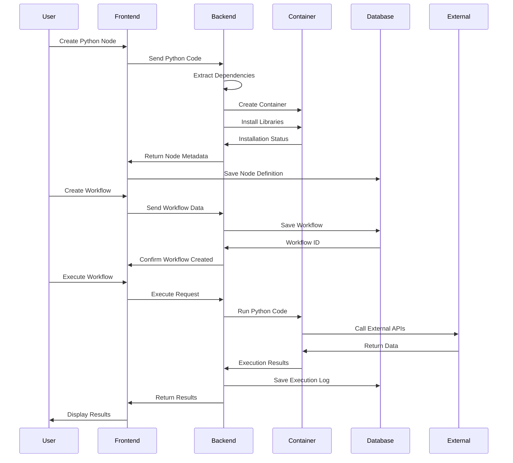
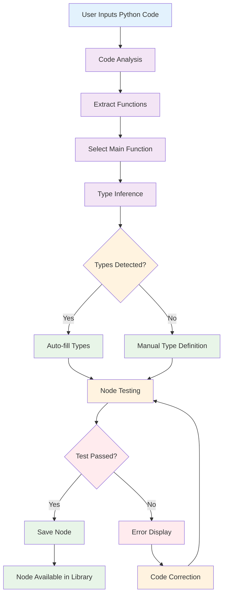
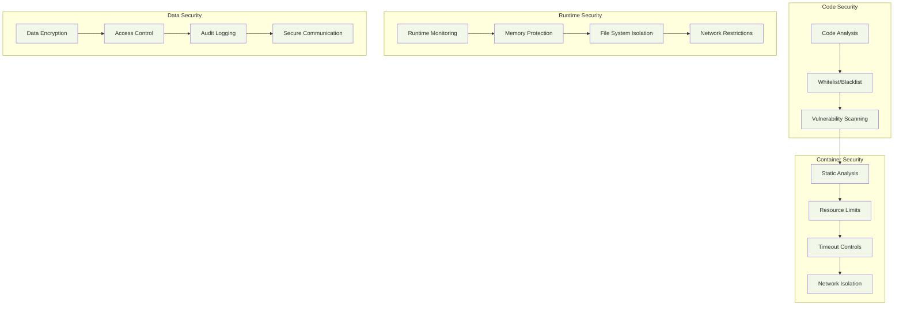
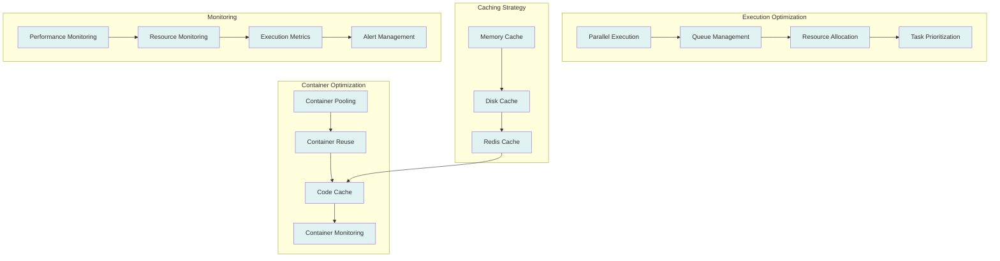

# Qflow Architecture Diagram

## Complete System Architecture

```mermaid
graph TB
    subgraph "Frontend Layer (n8n-based)"
        UI[Qflow Editor UI]
        
        subgraph "Python Node Components"
            PN[Python Node Editor]
            PE[Python Code Editor]
            TS[Type Selector]
            FS[Function Selector]
            TN[Node Tester]
            ND[Node Designer]
        end
        
        subgraph "Workflow Components"
            WF[Workflow Canvas]
            NC[Node Connections]
            EM[Execution Monitor]
            EL[Execution Logs]
            DV[Data Visualizer]
        end
        
        subgraph "State Management"
            PS[Python Nodes Store]
            WS[Workflows Store]
            ES[Execution Store]
            TS[Type System Store]
        end
    end
    
    subgraph "Backend Layer (Python-First)"
        API[FastAPI Backend]
        
        subgraph "Core Services"
            PES[Python Execution Service]
            CMS[Container Management Service]
            DMS[Dependency Management Service]
            WFS[Workflow Service]
            TSS[Type System Service]
            NS[Node Service]
        end
        
        subgraph "Execution Engine"
            PE[Python Execution Engine]
            TC[Type Checker]
            DC[Data Converter]
            EH[Error Handler]
            VM[Version Manager]
        end
        
        subgraph "Container Management"
            DC[Docker Client]
            CP[Container Pool]
            CI[Container Isolation]
            RL[Resource Limits]
        end
    end
    
    subgraph "Data Layer"
        DB[(PostgreSQL)]
        REDIS[(Redis Cache)]
        FS[File Storage]
        
        subgraph "Data Models"
            WD[Workflow Data]
            ED[Execution Data]
            ND[Node Data]
            UD[User Data]
        end
    end
    
    subgraph "Python Environments"
        subgraph "Docker Containers"
            PY38[Python 3.8]
            PY39[Python 3.9]
            PY310[Python 3.10]
            PY311[Python 3.11]
            PY312[Python 3.12]
        end
        
        subgraph "Library Management"
            PIP[Pip Installer]
            REQ[Requirements Manager]
            DEP[Dependency Resolver]
            CACHE[Package Cache]
        end
    end
    
    subgraph "External Integrations"
        subgraph "AI Services"
            AI[AI Services]
            OPENAI[OpenAI API]
            OPENROUTER[OpenRouter]
            OLLAMA[Ollama]
        end
        
        subgraph "Data Sources"
            WEB[Web Services]
            FILE[File Systems]
            DB_EXT[External Databases]
            API_EXT[External APIs]
        end
        
        subgraph "Triggers"
            SCHEDULE[Scheduled Tasks]
            WEBHOOK[Webhooks]
            FILE_WATCH[File Watchers]
            DB_TRIGGER[Database Triggers]
        end
    end
    
    subgraph "Security & Performance"
        subgraph "Security"
            CS[Container Sandboxing]
            CL[Resource Limits]
            CA[Code Analysis]
            NS[Network Security]
        end
        
        subgraph "Performance"
            CPOOL[Container Pooling]
            PEXEC[Parallel Execution]
            CACHE[Result Caching]
            MONITOR[Performance Monitoring]
        end
    end
    
    %% Frontend connections
    UI --> PN
    UI --> WF
    UI --> EM
    
    PN --> PE
    PN --> TS
    PN --> FS
    PN --> TN
    PN --> ND
    
    WF --> NC
    WF --> EL
    WF --> DV
    
    PS --> API
    WS --> API
    ES --> API
    TS --> API
    
    %% Backend connections
    API --> PES
    API --> CMS
    API --> DMS
    API --> WFS
    API --> TSS
    API --> NS
    
    PES --> PE
    PE --> TC
    PE --> DC
    PE --> EH
    PE --> VM
    
    CMS --> DC
    DC --> CP
    CP --> CI
    CI --> RL
    
    DMS --> PIP
    DMS --> REQ
    DMS --> DEP
    DEP --> CACHE
    
    %% Data connections
    API --> DB
    API --> REDIS
    API --> FS
    
    DB --> WD
    DB --> ED
    DB --> ND
    DB --> UD
    
    %% Container connections
    PE --> PY38
    PE --> PY39
    PE --> PY310
    PE --> PY311
    PE --> PY312
    
    PIP --> PY38
    PIP --> PY39
    PIP --> PY310
    PIP --> PY311
    PIP --> PY312
    
    %% External connections
    PE --> AI
    PE --> WEB
    PE --> FILE
    PE --> DB_EXT
    PE --> API_EXT
    
    AI --> OPENAI
    AI --> OPENROUTER
    AI --> OLLAMA
    
    WEB --> SCHEDULE
    WEB --> WEBHOOK
    WEB --> FILE_WATCH
    WEB --> DB_TRIGGER
    
    %% Security connections
    CS --> CI
    CL --> RL
    CA --> PE
    NS --> API
    
    %% Performance connections
    CPOOL --> CP
    PEXEC --> PE
    CACHE --> REDIS
    MONITOR --> API
    
    %% Styling
    classDef frontend fill:#e3f2fd,stroke:#2196f3,stroke-width:2
    classDef backend fill:#f3e5f5,stroke:#9c27b0,stroke-width:2
    classDef data fill:#e8f5e8,stroke:#4caf50,stroke-width:2
    classDef containers fill:#fff3e0,stroke:#ff9800,stroke-width:2
    classDef external fill:#ffebee,stroke:#f44336,stroke-width:2
    classDef security fill:#f1f8e9,stroke:#8bc34a,stroke-width:2
    
    class UI,PN,PE,TS,FS,TN,ND,WF,NC,EM,EL,DV,PS,WS,ES,TS frontend
    class API,PES,CMS,DMS,WFS,TSS,NS,PE,TC,DC,EH,VM,DC,CP,CI,RL backend
    class DB,REDIS,FS,WD,ED,ND,UD data
    class PY38,PY39,PY310,PY311,PY312,PIP,REQ,DEP,CACHE containers
    class AI,OPENAI,OPENROUTER,OLLAMA,WEB,FILE,DB_EXT,API_EXT,SCHEDULE,WEBHOOK,FILE_WATCH,DB_TRIGGER external
    class CS,CL,CA,NS,CPOOL,PEXEC,CACHE,MONITOR security
```

## Data Flow Architecture

## Python Node Creation Flow

## Workflow Execution Architecture

## Security Architecture

## Performance Architecture

## Key Architectural Features

### 🎯 **Core Design Principles**
- **Python-First**: Native Python execution in isolated containers
- **Visual Workflow**: Inherit n8n's powerful drag-and-drop interface
- **Type Safety**: Comprehensive type checking and validation
- **Security**: Multi-layered security with container isolation
- **Performance**: Optimized execution with caching and pooling

### 🔧 **Technology Stack**
- **Frontend**: Vue.js 3, Vue Flow, CodeMirror 6, Element Plus
- **Backend**: FastAPI, Celery, Docker, PostgreSQL, Redis
- **Execution**: Python runtime, pip, type checking, error handling
- **Security**: Container sandboxing, resource limits, code analysis

### 📊 **Scalability Features**
- **Container Pooling**: Reuse containers for better performance
- **Parallel Execution**: Run independent nodes concurrently
- **Caching Strategy**: Multi-level caching for faster execution
- **Auto Scaling**: Dynamic resource allocation based on load

### 🛡️ **Security Measures**
- **Container Isolation**: Complete sandboxing of Python code
- **Resource Limits**: CPU, memory, and time restrictions
- **Code Analysis**: Static analysis for security vulnerabilities
- **Network Security**: Restricted network access for containers

This architecture provides a robust foundation for Qflow while maintaining the visual workflow design capabilities of n8n and adding powerful Python execution capabilities. 