# Type-Based Node Linking Diagrams

## Type Compatibility Flow


## Compatible vs Incompatible Connections


## Type Hierarchy and Inheritance


## Frontend Validation Flow


## Backend Type Validation


## Error Handling and User Feedback


## Example Workflow with Type Validation

```mermaid
graph TD
    subgraph "Data Processing Workflow"
        A[CSV Reader<br/>Output: list] --> B[Data Filter<br/>Input: list<br/>Output: list]
        B --> C[Data Transform<br/>Input: list<br/>Output: dict]
        C --> D[JSON Writer<br/>Input: dict]
        
        E[Image Loader<br/>Output: image] --> F[Image Processor<br/>Input: image<br/>Output: image]
        F --> G[File Saver<br/>Input: file]
        
        H[Number Generator<br/>Output: number] --> I[Calculator<br/>Input: number<br/>Output: number]
        I --> J[Chart Creator<br/>Input: number]
    end
    
    subgraph "Type Validation Results"
        K[✓ Compatible] --> L[list → list]
        L --> M[✓ Compatible]
        M --> N[✓ Compatible]
        
        O[✓ Compatible] --> P[image → image]
        P --> Q[✓ Compatible]
        
        R[✓ Compatible] --> S[number → number]
        S --> T[✓ Compatible]
    end
    
    style A fill:#e8f5e8
    style B fill:#e8f5e8
    style C fill:#e8f5e8
    style D fill:#e8f5e8
    style E fill:#e8f5e8
    style F fill:#e8f5e8
    style G fill:#e8f5e8
    style H fill:#e8f5e8
    style I fill:#e8f5e8
    style J fill:#e8f5e8
```



## Type Conversion Examples

```mermaid
graph LR
    subgraph "Automatic Type Conversions"
        A[list] --> B[array]
        C[dict] --> D[object]
        E[integer] --> F[number]
        G[tuple] --> H[list]
    end
    
    subgraph "Manual Type Conversions"
        I[string] --> J[number<br/>int() or float()]
        K[list] --> L[dict<br/>dict() conversion]
        M[number] --> N[string<br/>str() conversion]
        O[dict] --> P[list<br/>list() conversion]
    end
    
    subgraph "Type Conversion Nodes"
        Q[Type Converter Node] --> R[Input: any<br/>Output: target_type]
        S[Data Transformer] --> T[Input: source_type<br/>Output: target_type]
    end
    
    style A fill:#e8f5e8
    style B fill:#e8f5e8
    style C fill:#e8f5e8
    style D fill:#e8f5e8
    style E fill:#e8f5e8
    style F fill:#e8f5e8
    style G fill:#e8f5e8
    style H fill:#e8f5e8
    
    style I fill:#fff3e0
    style J fill:#fff3e0
    style K fill:#fff3e0
    style L fill:#fff3e0
    style M fill:#fff3e0
    style N fill:#fff3e0
    style O fill:#fff3e0
    style P fill:#fff3e0
    
    style Q fill:#f3e5f5
    style R fill:#f3e5f5
    style S fill:#f3e5f5
    style T fill:#f3e5f5
```

## Performance Optimization


## Security Considerations


## Key Benefits

### 🎯 **Type Safety**
- **Prevents Runtime Errors**: Catch type mismatches before execution
- **Compile-time Validation**: Validate connections during design
- **Visual Feedback**: Clear indication of valid/invalid connections

### 🔧 **Developer Experience**
- **Intuitive Interface**: Easy-to-understand type system
- **Helpful Suggestions**: Automatic suggestions for compatible types
- **Error Recovery**: Multiple ways to fix type issues

### 🚀 **Performance**
- **Fast Validation**: Cached type compatibility checks
- **Efficient Execution**: No runtime type conversion overhead
- **Optimized Memory**: Minimal memory footprint for type system

### 🛡️ **Security**
- **Type Isolation**: Prevent malicious type manipulation
- **Whitelist Control**: Only allow safe type combinations
- **Container Security**: Type validation within isolated environments

This type-based node linking system ensures reliable, safe, and efficient workflow execution while providing an excellent user experience. 